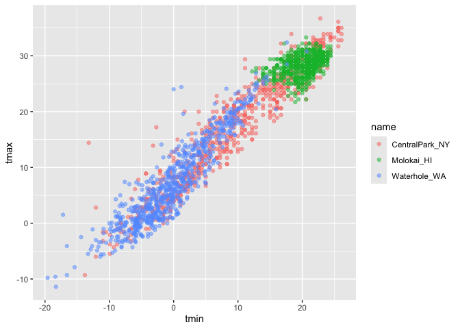
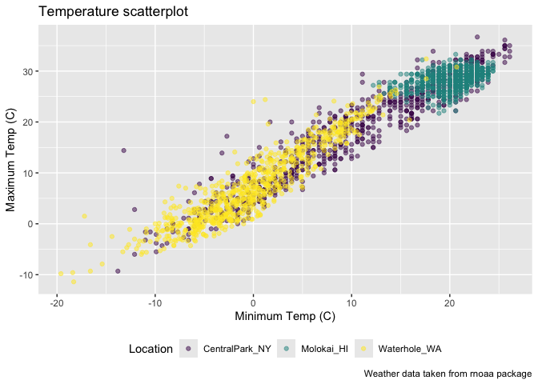
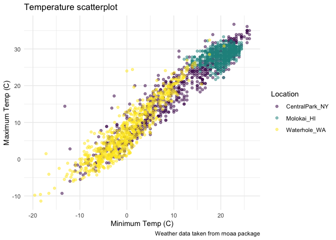
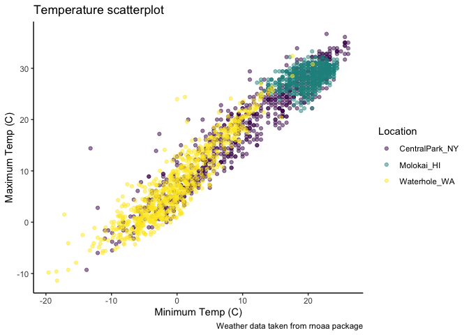
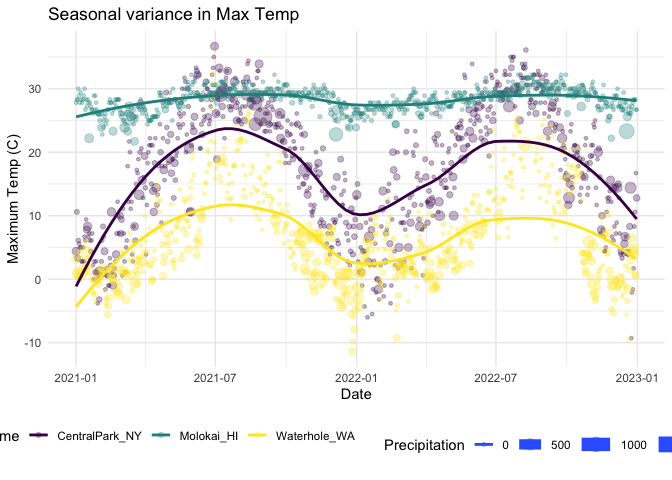
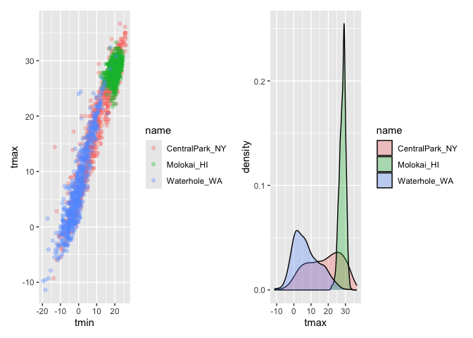
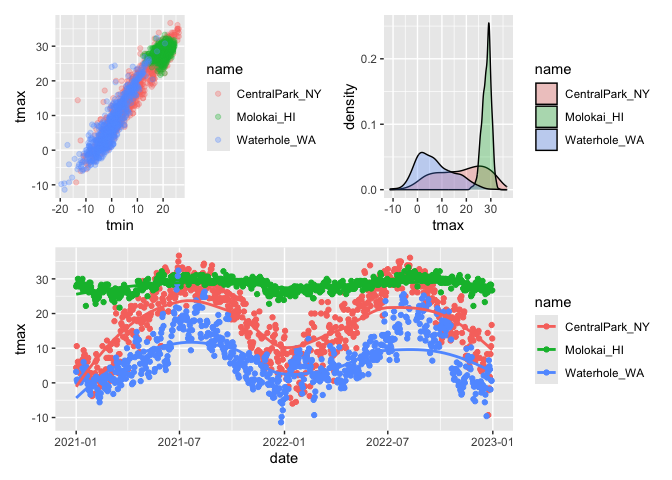
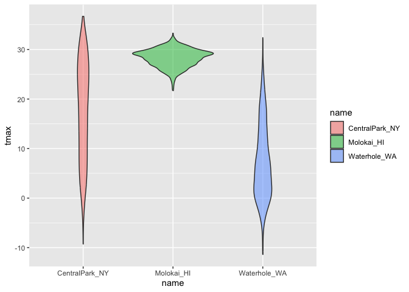

viz_2
================
Tong Su
2024-10-01

``` r
library(tidyverse)
```

    ## ── Attaching core tidyverse packages ──────────────────────── tidyverse 2.0.0 ──
    ## ✔ dplyr     1.1.4     ✔ readr     2.1.5
    ## ✔ forcats   1.0.0     ✔ stringr   1.5.1
    ## ✔ ggplot2   3.5.1     ✔ tibble    3.2.1
    ## ✔ lubridate 1.9.3     ✔ tidyr     1.3.1
    ## ✔ purrr     1.0.2     
    ## ── Conflicts ────────────────────────────────────────── tidyverse_conflicts() ──
    ## ✖ dplyr::filter() masks stats::filter()
    ## ✖ dplyr::lag()    masks stats::lag()
    ## ℹ Use the conflicted package (<http://conflicted.r-lib.org/>) to force all conflicts to become errors

``` r
library(patchwork)
```

``` r
weather_df = 
  rnoaa::meteo_pull_monitors(
    c("USW00094728", "USW00022534", "USS0023B17S"),
    var = c("PRCP", "TMIN", "TMAX"), 
    date_min = "2021-01-01",
    date_max = "2022-12-31") |>
  mutate(
    name = case_match(
      id, 
      "USW00094728" ~ "CentralPark_NY", 
      "USW00022534" ~ "Molokai_HI",
      "USS0023B17S" ~ "Waterhole_WA"),
    tmin = tmin / 10,
    tmax = tmax / 10) |>
  select(name, id, everything())
```

    ## using cached file: /Users/sutong/Library/Caches/org.R-project.R/R/rnoaa/noaa_ghcnd/USW00094728.dly

    ## date created (size, mb): 2024-09-10 14:24:18.750056 (8.639)

    ## file min/max dates: 1869-01-01 / 2024-09-30

    ## using cached file: /Users/sutong/Library/Caches/org.R-project.R/R/rnoaa/noaa_ghcnd/USW00022534.dly

    ## date created (size, mb): 2024-09-10 14:24:23.809326 (3.915)

    ## file min/max dates: 1949-10-01 / 2024-09-30

    ## using cached file: /Users/sutong/Library/Caches/org.R-project.R/R/rnoaa/noaa_ghcnd/USS0023B17S.dly

    ## date created (size, mb): 2024-09-10 14:24:25.315717 (1.036)

    ## file min/max dates: 1999-09-01 / 2024-09-30

``` r
weather_df |> 
  ggplot(aes(x = tmin, y = tmax)) + 
  geom_point(aes(color = name), alpha = .5)
```

    ## Warning: Removed 17 rows containing missing values or values outside the scale range
    ## (`geom_point()`).

<!-- --> Look at color

``` r
ggp_scatterplot =
weather_df |> 
  ggplot(aes(x = tmin, y = tmax, color=name)) + 
  geom_point(alpha = .5) + 
  labs(
    title= "Temperature scatterplot",
    x="Minimum Temp (C)",
    y="Maximum Temp (C)",
    color="Location",
    caption = "Weather data taken from rnoaa package"
  ) +
  viridis::scale_color_viridis(discrete = TRUE)
```

``` r
ggp_scatterplot +
  theme(legend.position = "bottom")
```

    ## Warning: Removed 17 rows containing missing values or values outside the scale range
    ## (`geom_point()`).

<!-- -->

``` r
ggp_scatterplot +
  theme_bw()
```

    ## Warning: Removed 17 rows containing missing values or values outside the scale range
    ## (`geom_point()`).

<!-- -->

``` r
  theme(legend.position = "bottom")
```

    ## List of 1
    ##  $ legend.position: chr "bottom"
    ##  - attr(*, "class")= chr [1:2] "theme" "gg"
    ##  - attr(*, "complete")= logi FALSE
    ##  - attr(*, "validate")= logi TRUE

Order matters

``` r
ggp_scatterplot +
  theme(legend.position = "bottom") +
  theme_bw()
```

    ## Warning: Removed 17 rows containing missing values or values outside the scale range
    ## (`geom_point()`).

<!-- -->

``` r
ggp_scatterplot +
  theme(legend.position = "bottom") +
  theme_minimal()
```

    ## Warning: Removed 17 rows containing missing values or values outside the scale range
    ## (`geom_point()`).

<!-- -->

``` r
ggp_scatterplot +
  theme(legend.position = "bottom") +
  theme_classic()
```

    ## Warning: Removed 17 rows containing missing values or values outside the scale range
    ## (`geom_point()`).

<!-- -->

New scatterplot

``` r
weather_df |>
  ggplot(aes(x=date, y=tmax, color=name, size=prcp)) +
  geom_point(alpha = .3) +
  geom_smooth(se=FALSE) + 
  viridis::scale_color_viridis(discrete = TRUE) +
  labs(
    x= "Date",
    y="Maximum Temp (C)",
    title= "Seasonal variance in Max Temp",
    size="Precipitation"
  )+
  theme_minimal()+
  theme(legend.position="bottom")
```

    ## Warning: Using `size` aesthetic for lines was deprecated in ggplot2 3.4.0.
    ## ℹ Please use `linewidth` instead.
    ## This warning is displayed once every 8 hours.
    ## Call `lifecycle::last_lifecycle_warnings()` to see where this warning was
    ## generated.

    ## `geom_smooth()` using method = 'loess' and formula = 'y ~ x'

    ## Warning: Removed 17 rows containing non-finite outside the scale range
    ## (`stat_smooth()`).

    ## Warning: The following aesthetics were dropped during statistical transformation: size.
    ## ℹ This can happen when ggplot fails to infer the correct grouping structure in
    ##   the data.
    ## ℹ Did you forget to specify a `group` aesthetic or to convert a numerical
    ##   variable into a factor?

    ## Warning: Removed 19 rows containing missing values or values outside the scale range
    ## (`geom_point()`).

<!-- -->

Extra bonus stuff in ggplot

Use different datasets in different ’geom’s

``` r
central_park_df =
  weather_df |>
  filter(name == "CentralPark_NY")

molokai_df =
  weather_df |>
  filter(name == "Molokai_HI")

molokai_df|>
  ggplot(aes(x=date,y=tmax, color=name)) +
  geom_point()+
  geom_line(data = central_park_df)
```

    ## Warning: Removed 1 row containing missing values or values outside the scale range
    ## (`geom_point()`).

<!-- --> \#Multiple
panels

``` r
weather_df |>
  ggplot(aes(x=tmax, fill =name)) +
  geom_density()+
  facet_grid(.~name)
```

    ## Warning: Removed 17 rows containing non-finite outside the scale range
    ## (`stat_density()`).

<!-- -->

``` r
ggp_tmax_tmin = 
  weather_df |>
  ggplot(aes(x=tmin, y=tmax, color=name)) +
  geom_point(alpha=.3)

ggp_tmax_density = 
  weather_df |>
  ggplot(aes(x=tmax, fill=name)) +
  geom_density(alpha=.3)

ggp_tmax_tmin + ggp_tmax_density
```

    ## Warning: Removed 17 rows containing missing values or values outside the scale range
    ## (`geom_point()`).

    ## Warning: Removed 17 rows containing non-finite outside the scale range
    ## (`stat_density()`).

<!-- -->

``` r
ggp_tmax_tmin = 
  weather_df |>
  ggplot(aes(x=tmin, y=tmax, color=name)) +
  geom_point(alpha=.3)

ggp_tmax_density = 
  weather_df |>
  ggplot(aes(x=tmax, fill=name)) +
  geom_density(alpha=.3)

ggp_tmax_date=
  weather_df |>
  ggplot(aes(x=date, y=tmax, color=name)) +
  geom_point()+
  geom_smooth(se=FALSE)


(ggp_tmax_tmin + ggp_tmax_density)/ggp_tmax_date
```

    ## Warning: Removed 17 rows containing missing values or values outside the scale range
    ## (`geom_point()`).

    ## Warning: Removed 17 rows containing non-finite outside the scale range
    ## (`stat_density()`).

    ## `geom_smooth()` using method = 'loess' and formula = 'y ~ x'

    ## Warning: Removed 17 rows containing non-finite outside the scale range
    ## (`stat_smooth()`).

    ## Warning: Removed 17 rows containing missing values or values outside the scale range
    ## (`geom_point()`).

<!-- -->

\##Data manipulation

``` r
weather_df |>
  ggplot(aes(x=name, y=tmax, fill=name)) +
  geom_violin(alpha=.5)
```

    ## Warning: Removed 17 rows containing non-finite outside the scale range
    ## (`stat_ydensity()`).

<!-- -->

``` r
weather_df |>
  mutate(name = forcats::fct_relevel(name, c("Molokai_HI", "CentralPark_NY", "Waterhole_WA")))|>
  ggplot(aes(x=name, y=tmax, fill=name)) +
  geom_violin(alpha=.5)
```

    ## Warning: Removed 17 rows containing non-finite outside the scale range
    ## (`stat_ydensity()`).

<!-- -->
